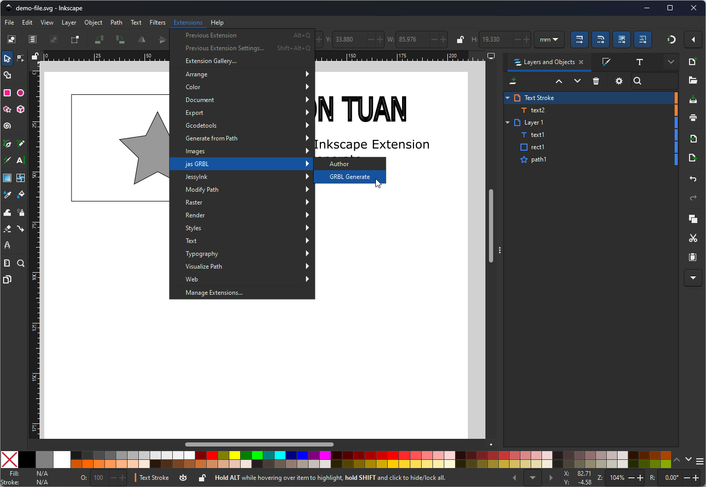
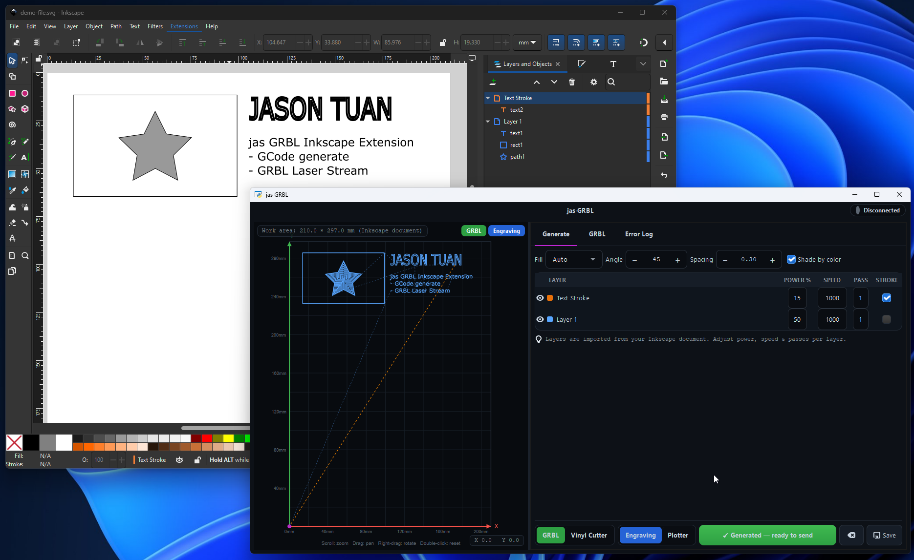
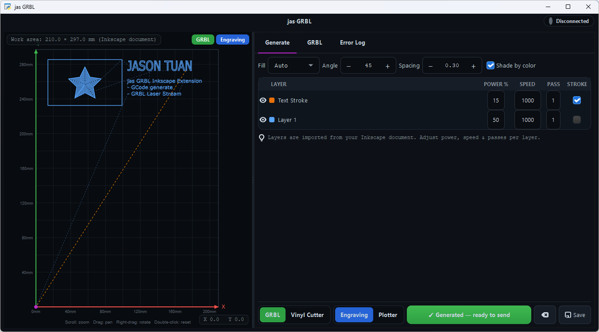
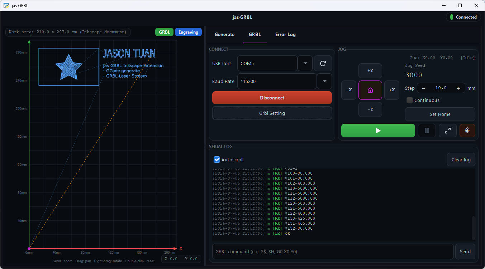

<div align="center">

# ⚡ jasGrbl

### An Inkscape extension that turns your drawing into GRBL laser G-code, previews the toolpath, and streams it to the machine over USB.

[](CHANGES_LOG.md)
[](https://inkscape.org/)
[](LICENSE)
[](#-installation)

**Design → Generate → Preview → Cut — without ever leaving Inkscape.**

</div>

---

## 👤 Author

| | |
|---|---|
| **Author** | Jason Tuấn |
| **Website** | [tuanquynh.com](https://tuanquynh.com) |

---

## 📖 Overview

**jasGrbl** is a Windows/macOS/Linux Inkscape extension built for GRBL laser engravers and
cutters. It reads the layers of your open document, lets you dial in cutting settings **per
layer**, generates clean GRBL G-code, and — if you want — streams that job straight to your
machine over USB. No round-trips through a separate CAM program.

It lives under **Extensions ▸ jas GRBL** and opens a full GTK dialog with a live toolpath
preview, so you always see exactly what the laser will do before a single photon fires.

### Highlights

- 🗂️ **Per-layer control** — set **Power / Speed / Pass count / Stroke-Text** independently
  for each Inkscape layer, not one global setting. Layers run top-first, matching the Layers
  panel.
- 🧠 **Smart fills** — an **Auto** mode picks the best strategy per shape (thin shapes →
  continuous Spiral, blocky shapes → Zigzag), plus Hatch, Cross-Hatch, Zigzag, Hilbert,
  Peano, Contour, Spiral, and Voronoi — each with safe fallbacks so it never crashes.
- 👁️ **Live toolpath preview** — a Cairo canvas with machine grid, axes at Home, burns solid,
  travel dashed, return-to-Home highlighted. Zoom, pan, and rotate. Your SVG is never modified.
- 🎯 **Real G-code** — G21/G90, M4 dynamic (or M3 constant) laser, S-power scaling, multi-pass,
  greedy travel optimization, home-corner mapping, and **true G2/G3 arcs** for smooth curves.
- ✍️ **Centerline text** — engrave text as single-stroke medial-axis paths (not filled blobs)
  with the per-layer **Stroke Text** option.
- 🔌 **Built-in USB streaming** — connect, jog, set home, and stream the job with a colorized
  serial log, pause/stop, and safety confirmation (requires `pyserial`).
- 💾 **Export or stream** — save a `.gcode` file, or send it directly to the machine.

---

## 🖼️ Screenshots

<table>
  <tr>
    <td width="50%" align="center">
      <br/>
      <sub><b>Launch from Extensions ▸ jas GRBL</b></sub>
    </td>
    <td width="50%" align="center">
      <br/>
      <sub><b>Design in Inkscape, generate right alongside</b></sub>
    </td>
  </tr>
  <tr>
    <td width="50%" align="center">
      <br/>
      <sub><b>Generate tab — per-layer Power/Speed/Passes, smart fills, live preview</b></sub>
    </td>
    <td width="50%" align="center">
      <br/>
      <sub><b>GRBL tab — connect over USB, jog, and stream with a live serial log</b></sub>
    </td>
  </tr>
</table>

---

## ✅ Requirements

**You only need Inkscape** — the extension runs on Inkscape's own bundled Python, so there
is no separate Python setup, virtualenv, or `pip install` for normal use.

| Component | Purpose | Where it comes from |
|-----------|---------|---------------------|
| Inkscape **1.2+** (targets **1.4.2**) | Host application | — |
| Python 3, `inkex`, `lxml`, Cairo | Extension API and SVG/preview handling | Bundled with Inkscape |
| PyGObject (`gi`) + **GTK 3** | The dialog UI | Bundled with Inkscape (Windows/macOS). On Linux, install `python3-gi` + `gir1.2-gtk-3.0` if missing |

Works on **Windows, macOS, and Linux**.

### Optional extras

Install these into **Inkscape's bundled Python** only if you want the feature — each is a
lazy import with a safe fallback, so the extension never crashes when one is absent:

| Package | Enables | If missing |
|---------|---------|------------|
| **`pyserial`** | USB streaming (connect / jog / stream to the machine) | G-code still generates and saves; only USB sending is unavailable |
| `numpy` | High-quality single-stroke (centerline) text | Falls back to a raster medial-axis |
| `scipy` | Voronoi fill | Falls back to Hatch |

```bash
# Only needed for USB streaming:
pip install pyserial
```

---

## 📦 Installation

> **Requires Inkscape 1.2 or newer** (the built-in Extension Manager). On older versions,
> use the [manual method](#manual-installation-any-inkscape-version) instead.

### Install from the `.zip` (recommended)

1. Download the latest **`jasGrbl-<version>.zip`** from the `releases/` folder.
2. In Inkscape, open **Extensions ▸ Manage Extensions**.
3. Go to the **Install Package** section and click the **folder / open-file** button.
4. In the file dialog, **change the file-type filter to “All Files”** — otherwise the `.zip`
   will **not** appear in the list and you will not be able to select it. ⚠️
5. Select **`jasGrbl-<version>.zip`** and confirm.
6. **Restart Inkscape.** The extension will **not** show up until you fully close and reopen
   Inkscape. ⚠️
7. You’ll find it under **Extensions ▸ jas GRBL ▸ GRBL Generate**.

### Manual installation (any Inkscape version)

1. Unzip `jasGrbl-<version>.zip`.
2. Copy `jasgrbl.inx`, `jasgrbl.py`, and the `jasgrbl_pkg/` folder into your Inkscape user
   extensions directory:
   - **Windows:** `%APPDATA%\inkscape\extensions`
   - **macOS:** `~/Library/Application Support/org.inkscape.Inkscape/config/inkscape/extensions`
   - **Linux:** `~/.config/inkscape/extensions`

   (Exact path: **Edit ▸ Preferences ▸ System ▸ User extensions**.)
3. **Restart Inkscape.**

### Optional — enable USB streaming

The extension generates G-code without any extra dependencies. To also **stream over USB**,
install `pyserial` into the Python that Inkscape uses:

```bash
pip install pyserial
```

---

## 🛠️ Development

```bash
# Linux / macOS
./tools/dev_install.sh

# Windows (PowerShell)
powershell -ExecutionPolicy Bypass -File tools\dev_install.ps1
```

This links the repo into your Inkscape user extensions directory. After editing `.py` files,
just re-run the extension; after editing `.inx` files, restart Inkscape.

## 🧪 Test & package

```bash
python tests/test_core.py     # pure-Python core tests (no Inkscape needed)
python tools/package.py       # builds releases/jasGrbl-<version>.zip
```

The version comes from `__version__` in `jasgrbl_pkg/__init__.py`; the release `.zip` is
named to match.

---

## 📝 Changelog

See **[CHANGES_LOG.md](CHANGES_LOG.md)** for the full version history.

---

## 🙏 Acknowledgements

**jasGrbl** stands on the shoulders of these excellent open-source projects. A huge
**thank you — cảm ơn** to everyone who builds and maintains them. 💛

**Core (shipped with Inkscape):**

| Library | Role |
|---------|------|
| [Inkscape · inkex](https://inkscape.gitlab.io/extensions/) | Extension framework and SVG document API |
| [PyGObject](https://pygobject.gnome.org/) + [GTK 3](https://www.gtk.org/) | The dialog user interface |
| [Cairo](https://www.cairographics.org/) | Live toolpath preview rendering |
| [lxml](https://lxml.de/) | SVG / XML parsing |

**Optional (unlock extra features):**

| Library | Role |
|---------|------|
| [pySerial](https://github.com/pyserial/pyserial) | USB serial streaming to the machine |
| [NumPy](https://numpy.org/) | Centerline (single-stroke) text computation |
| [SciPy](https://scipy.org/) | Voronoi fill generation |

Thanks also to the **GRBL** community and to **LaserGRBL** / **LightBurn** for setting the
conventions this extension follows. 🚀

## 📄 License

Released under the [MIT License](LICENSE). © 2026 Jason Tuấn.

<div align="center">
<sub>Made with ⚡ by <a href="https://tuanquynh.com">Jason Tuấn</a></sub>
</div>
